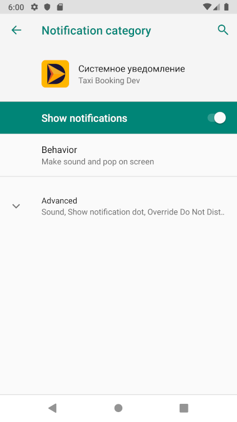
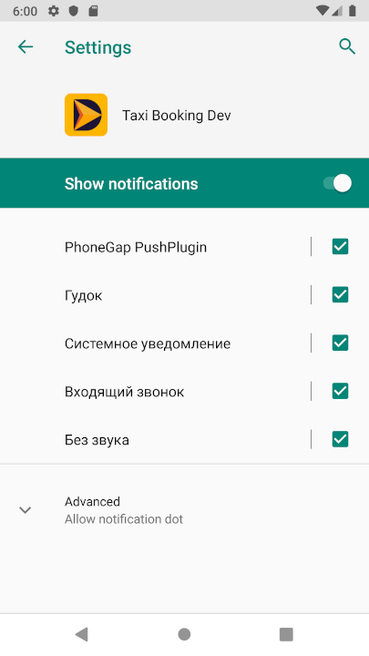

# Usage

## Get a notification channel
```js
NotificationManager.getNotificationChannel('channel_id')
    .then(console.info)
    .catch(console.error);
    
// NotificationChannel {id: "channel_id", importance: 5, lightColor: 0, lockscreenVisibility: -1000, openSettings: ƒ, …}
```

## Open a notification channel settings



### From the manager
```js
NotificationManager.openNotificationChannelSettings('channel_id')
    .then(console.info)
    .catch(console.error);
    
// OK
```


### From a channel
```js
NotificationManager.getNotificationChannel('channel_id')
    .then(function(channel) {
        channel.openSettings().
            .then(console.info)
            .catch(console.error);
    })
    .catch(console.error);
    
// OK
```

## Open an app notification settings



```js
NotificationManager.openAppNotificationSettings()
    .then(console.info)
    .catch(console.error);
    
// OK
```
